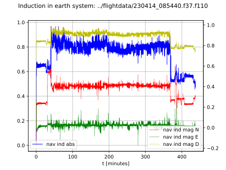
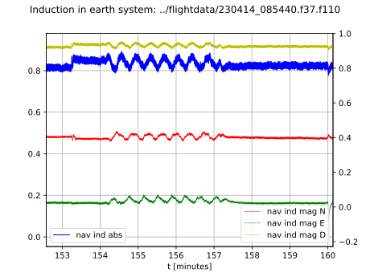
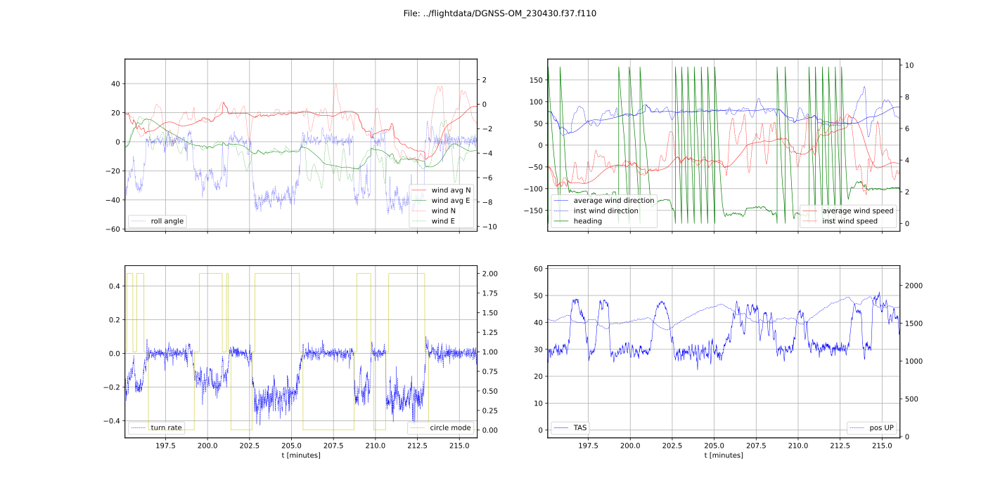

# Analysis
Python scripts to convert and plot larus raw or processed data. 

## How to start
You need one of the supported binary file such as:
- Raw measurement data record file from a Larus sensor e.g. (*.f37) which contains the non-processed raw sensor 
measurement values (ACC, GYRO, MAG, (D-)GNSS, Static, Pitot). 
- A with https://github.com/larus-breeze/SIL_flight_sensor_emulator/ generated flight log file such as *.f110 
which contains the raw measurement values and the calculated values (AHRS, WIND, VARIO, TAS, IAS, Earth Induction,
...)
- Supported files are described in dataformats.py

## Scripts
- binary_to_csv.py: Converts binary data to a human-readable csv data. 
- load_to_df.py: Python class to import one of the in dataformats.py described files into a pandas dataframe.
- plot_*.py: Files to generate plots from generated flight log files. 

### Example plots

    python3 binary_to_csv.py ../flightdata/230430_090724.f37
    python3 plot_wind.py ../flightdata/230414_085440.f37.f110
    python3 plot_mag.py ../flightdata/230414_085440.f37.f110

