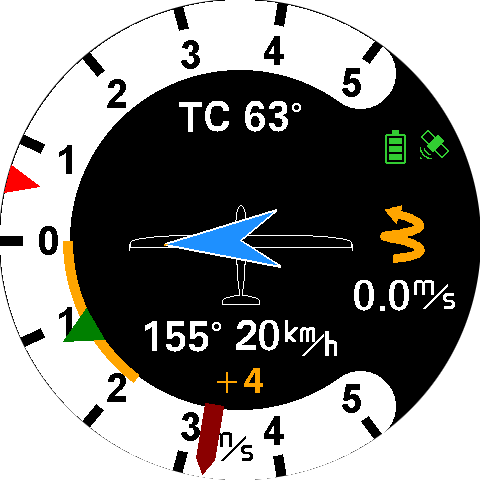

[ create a pdf-file from this markdown file: ]::
[ Install vsCode Extension Markdown PDF ]::
[ press Ctrl-Shift-p and enter Markdown PDF: export (pdf) ]::

# Contents
  [1.   Preliminary Remarks](#pr)\
  [1.1  Important Notices](#1.1)\
  [1.2  Limited Warranty](#1.2)\
  [1.3  Conventions and Pictograph Definitions](#1.3)\
  [2.  Safety](#2)\
  [2.1 Safety Precautions](#2.1)\
  [2.2 Proper Use](#2.2)\
  [2.3 Improper Use](#2.3)\
  [3. LARUS Vario Display Quick Installation Instructions](#3.)\
  [4. Product Description](#4.)\
  [4.1 Scope of Delivery](#4.1)\
  [4.2 Design and Function](#4.2)\
  [4.3 Connectors](#4.3)\
  [4.3.1 Overview of the Connectors](#4.3.1)\
  [4.3.2 CAN and RS232 Ports](#4..3.2)\
  [4.3.3 GPIO / D-SUB 9](#4.3.3)\
  [4.3.4 AUDIO](#4.3.4)\
  [4.3.5 SD-Card](#4.3.5)\
  [4.4. CAN Termination](#4.4)\
  [5. Installation](#5.)\
  [5.1 Installation Location](#5.1)\
  [5.2 Installation Orientation](#5.2)\
  [5.3 Initial Operation and Function Test](#5.3)\
  [5.4 Firmware Updates](#5.4)\
  [6. Operation](#6.)

# 1. Preliminary Remarks 

## 1.1 Important Notices 

Before using any part of the system, please read and understand this manual. All information in this document is subject to change without notice. The latest version can be downloaded from www.stefly.aero.
CoTexx GmbH does not accept responsibility for damages which are the result of installation and operation of the device.

## 1.2 Limited Warranty 

The LARUS Vario Display as well as its accessories are warranted to be free from defects in materials or workmanship for two years from the date of purchase. Within this period, CoTexx will, at its sole discretion, repair or replace any components that fail in normal use. Such repairs or replacement will be made at no charge to the customer for parts and labour, provided that the customer shall be responsible for any transportation cost. This warranty does not cover failures due to abuse, misuse, accident, or unauthorised alterations or repairs.

## 1.3 Conventions and Pictograph Definitions 

The safety instructions in SteFly operating manuals are the result of risk evaluations and hazard analyses. In this document, the following hazard levels and information are considered:

| Symbol | Importance |
|---------|-----------------------------------------------------------------------------------------------------------|
|  | Pay special attention to critical notes marked with a yellow caution symbol, because non-observance may result in damage or any other critical situation. |
| A red caution symbol signalizes that non-observance may result in injuries. |
 | Command to perform an action or task associated with a source of danger, the disregarding of which may result in serious accidents. |
 | A blue cloud indicates useful information or tips. |

# 2. Safety 

## 2.1 Safety Precautions 

|       |                                     |
|-------|-------------------------------------|
| | **Duty to inform**  Each person involved in the installation or operation of LARUS must read and observe the safety-related parts of these operating instructions. |

## 2.2 Proper Use 

LARUS Vario Display visualises data which are measured and calculated by the LARUS sensor box. 

LARUS was designed to calculate direction and strength of thermals and wind quickly and reliably. Therefore, the sensor unit combines data from high-precision sensors and GNSS receivers in sophisticated algorithms. 

LARUS Vario Display shall be installed in the instrument panel.

LARUS gliding sensor unit is an additional feature to supply glider pilots with accurate information about wind, vertical air movement as well as additional attitude of the aircraft. Its use is limited to day VFR conditions. Security decisions must be made regardless of having installed LARUS.

## 2.3 Improper Use 

Improper use will cause all claims for liability and guarantees to be forfeited. Improper use is deemed to be all use for purposes deviating from those mentioned above, especially:
* Using LARUS data in non-VFR conditions or during night is forbidden. LARUS is not certified. Although LARUS provides AHRS data to XCSoar you must not rely on the artificial horizon display.

* Using LARUS data during aerobatics or during flight conditions with high angle of attack (stall) or high g-forces. The algorithm was optimized for normal flight conditions.  

* Operating LARUS Vario Display outside the operation conditions defined in technical data section, e.g. input voltage, temperature and humidity.

## 3. LARUS Vario Display Quick Installation Instructions 

LARUS Vario Display may be operated out of the box. Simply perform the following actions:

1. Disassemble both rotary knobs with a 1,5 mm HEX key (scope of delivery)
1. Mount LARUS Vario Display in a 57 mm cutout of the instrument panel with 3 screws. It may be mounted in all four directions. 
1. Assemble both rotary knobs
1. Connect the CAN port of LARUS Vario Display and LARUS Sensor Box with a 1:1 patch cable included in scope of delivery. 
1. Power on LARUS 
1. Check that the satellite symbol on the screen is yellow or green and the current heading is shown.  
1. Your LARUS Vario Display is ready to fly!

 

# 4. Product Description 
## 4.1 Scope of Delivery 

The scope of delivery contains the following:
* LARUS Vario Display
* Mounting screws
* 1:1 standard RJ45 cable
* Micro SD card with adapter
* D-Sub-9 solder connector and housing
* 1,5 mm HEX key for mounting the rotary knobs

## 4.2 Design and Function 
LARUS Vario Display shows the data measured and calculated by LARUS. LARUS is an advanced variometer with real time wind measurement capabilities. It incorporates state of the art pressure sensors, an advanced IMU and GNSS receivers to gather precise flight information data. 
Key features of the display are: 
* Round display for 57 mm standard instrument panel cutouts
* Bright and colourful screen
* Lightweight, compact design with black anodised aluminium housing
* Two rotary knobs with pushbutton fuction to change settings and enter the menus

LARUS Vario Display is designed and continuously improved by Prof. Dr. Klaus Schäfer, Maximilian Betz, Winfried Simon, Peter Simon and the SteFly team. 

The system architecture of LARUS in **single seater configuration**: 

The system architecture of LARUS in **double seater configuration**: 

## 4.3 Connectors 

### 4.3.1 Overview of the Connectors 

 

 

### 4.3.2 CAN and RS232 Ports 

 

|Pin	|CAN | RS232|
|---|------|----------------|
|1|	GND| GND |
|2|	GND (internally connected to 1) | GND (internally connected to 1) | 	
|3|	NC|	RS232_1_RX|
|4|	CAN Low|	RS232_1_TX|
|5|	CAN High|	NC|
|6|	NC|	NC|
|7|	VCC [9-28V DC] |	VCC [9-28V DC] |
|8|	VCC (internally connected to 7)	| VCC (internally connected to 7)|

 

If a serial connection (RS232) is established between SteFly NAV and LARUS Vario Display, the MC value settings, for example, can be synchronized / transferred between the devices. In addition, the LARUS Vario Display processes inputs from a Speed to Fly / Vario switch that is connected directly to the SteFly Remote Control Stick PCB (for necessary settings see chapter 6). 

The following steps are required: 
* Connect devices with cable: 
 * Option 1: between Vario Display RS232 port and SteFly NAV ttySx port with patch cable RX/TX crossed
 * Option 2: between Vario Display RS232 port und LARUS Sensor Box with 1:1 patch cable
* Adjust settings in XCSoar (7.44 or higher) / OpenSoar (7.43 or higher):
  * If the Vario Display is connected directly to SteFly NAV, select the corresponding ttyS port: Config -> Devices -> select a free line and enter the port, Baud rate: 38400, Driver Larus, Sync. to device on

 

### 4.3.3 GPIO / D-SUB 9 

Several other switches, sensors and devices can be connected via the D-Sub connector. Please note that not all functions have been implemented at date of release of this manual. 

The following sketch shows the view into the male connector of the LARUS Vario Display. 

|Pin number|	Pin name |	I/O|
|----|--------|---------|
|1	|GND	|(Ground)|
|2	|DI3  |Gear - Input|
|3	|DI1 | Water Ballast - Input|
|4	|DO2|	Output, not yet supported|
|5	|GND|	(Ground)|
|6	|DI4 | Speed Brakes - Input|
|7	|DI2 | Speed to Fly	- Input|
|8	|GND |	(Ground)|
|9	|DO1 | SteFly Canopy Flasher- Output|

For easier pin identification these numbers are also molded into the female connector (scope of delivery). 
After wiring, settings must be made in the LARUS Vario Display, see [chapter 6.](#DIO-Doc)

### 4.3.4 AUDIO 
An audio socket is available for connecting a loudspeaker with a 3.5 mm jack plug.  The internal resistance of the speaker must be between 4-8 Ω (max. output of 3 W @ 8 Ω).

|  |  |
|------------------------|-------------------------------------------------------------------------------------------|
 | A single loudspeaker must not be connected to more than one device.|

 

### 4.3.5 SD-Card 
The device has an SD card slot for firmware updates.  

|  |  |
|------------------------|-------------------------------------------------------------------------------------------|
 | As SD card extensions can damage the Vario Display, we do not accept any liability for damage resulting from their use. |

## 4.4 CAN Termination  

LARUS Vario Display and LARUS Sensor Box are connected via CAN. CAN bus networks require termination resistors at each end of the network. Therefore, all units have integrated a switch to activate the resistor:

 

The following table gives examples of how to set the CAN termination switches: 

|Description|Display front| Larus Box| CAN Splitter |  Display rear|
|--|--|--|--|--|
|Single seater	|on|	on|	-|	-|
|Double seater LARUS box in front panel|	off|	on|	off|	on|
|Double seater, LARUS box in rear panel|	on|	on|	off|	off|

Please note: All LARUS Sensor Boxes delivered before March 2025 have no CAN termination switch.  CAN termination is always on from default.

# 5. Installation 

| | |
|-----|-|
| Usually, LARUS Vario Display is powered by LARUS via patch cable between the CAN ports. LARUS needs to be protected by an external fuse (500 mA to max. 3A) like it is common practice for all electric devices in aviation. If LARUS gets its energy from another main instrument (e.g. SteFly NAV via D-Sub connector) please make sure that the main instrument is protected by an external fuse. |

## 5.1 Installation Location 

The following picture shows a typical installation situation of LARUS Vario Display in the instrument panel of a glider. 

The display fits in a standard 57 mm cutout and is fastened by 3 M3 screws.

For installation it is required to remove the two rotary knobs with a HEX 1,5mm key. 

 

## 5.2 Installation Orientation 

| | |
|-----|-|
 | If you want to replace an existing instrument with the Larus Vario Display, check the desired installation position before drilling the 7.3 mm hole for the rotary encoder due to the asymmetrical housing to the display |

The display can be mounted in the orientations 0° / 90° / 180° / 270°. 

After mounting the display, it's orientation needs to be configured in the menu [Display Rotation](#DisplayRotation)

## 5.3 Initial Operation and Function Test  

For initial operation please follow these steps: 
1. Check that the LARUS Vario Display is connected to LARUS Sensor Box or CAN Splitter according to the drawings in chapter 4.2 
1. Power on LARUS
1. Check that LARUS Vario Displays boots and a yellow or green satellite pictogram appears. The vario pointers should perform slight movements around zero position.

## 5.4 Firmware Updates 

The LARUS team is continuously improving the software and releasing updates e.g. on LARUS Vario Display web page. 

To update the firmware, put the new .bin-file on the SD card included in scope of delivery and insert it into the SD-card slot of LARUS Vario Display. Power on the Vario Display and the process will begin automatically. You will see a message until update is completed. Afterwards the name of the new firmware version will appear.

If the update is not initialized when the SD card was inserted, please do a “factory reset” of the display first: Long click on the button -> Expert -> Factory Reset

Requirements for the SD card: min. 4 GB SDHC, FAT32 format (not GPT) The device has 2 rotary knobs and a push button that can be used to make various settings. 

# 6. Operation 

The knobs and the button are assigned as follows: 
* Turn the small/upper rotary knob: Volume control. 
When entering values: change values in small steps (1 unit).
* Turn the large/lower rotary knob: Set the MacCready value 
When entering values: change value in large steps (10 units)
* Short press on the rotary knob: Menu for common settings
* Long press on the rotary knob: Menu for special settings and calibration of LARUS

## 6.1 Variometer Display
### 6.1.1 ***Variometer Mode*** Display

 

### 6.1.2 ***Speed To Fly Mode*** Display

## 6.1 Menu Structure 
### 6.1.1 Short press Menu Structure: 

* Water Balast 
    Enter the current value for the amount of water balast. The entered value is propagated to XCSoar/OpenSoar.
* Bugs 
    Enter the fly correction factor in percent to adjust the polar values to the contamination situation of the wing.
* Pilot Weight 
    Enter the pilots weight in kg for the area load calculation.
* Display 
    Use this option to change between Vario and AHRS display.

| | |
|----|------|
 | The purpose of the Varios AHRS Display is providing information for validating the Larus Sensorbox Data (Magnetic Heading Course and spatial position of the Sensor/Airplane). AHRS must not be used as an flight instrument. |

### 6.1.2 Long press Menu Structure: 
* Views
  * Info 1 Content
    * None
    * Avg Climb Rate
    * Drift Angle
    * Flight Level
    * Speed To Fly
    * True Course
    * UTC Time
  * Info 2 Content 
      Same Options as Info 1 Content
  * Center Circling
    * Single Arrow
    * Double Arrow
    * Dotted Assistant
    * Spider Assistant
  * Center Straight
    * Single Arrow
    * Double Arrow
  *  
    Display Rotation
    * Rotate 0°/90°/180°/270°
  * Glider Symbol 
    * On / Off
  * Advanced
    * User Profile
      * User Profile 1
      * User Profile 2
      * User Profile 3
      * User Profile 4
      * Do not change
    * Center Frequency  
        Select the Frequency for 0 m/s (500-1000 Hz)
    * Battery Good 
        Select the voltage value below which the battery symbol gets yellow
    * Battery Bad 
        Select the voltage value below which the battery symbol gets red
    *  
      Flash Control   
      * Not connected
      * Active: open
      * Active: close
    * Config Reset  
        Resets all Advanced Configuration Parameters to factory settings.
    * Average Climb Rate
      * Average Climb Source
        * Frontend
        * Sensorbox
      * TC Climb Rate
    * Speed to Fly
      * TC Speed To Fly
      * Vario Control
      * STF Pin Config    
    * Gear Alarm
    * Drain Control
    ◦ Polar Settings
    ◦ Sensorbox