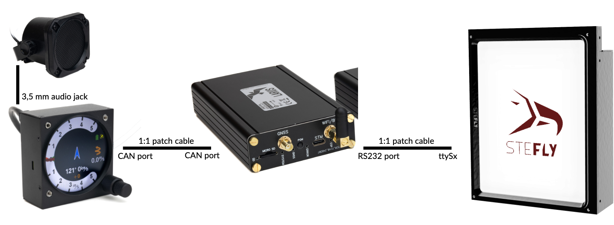
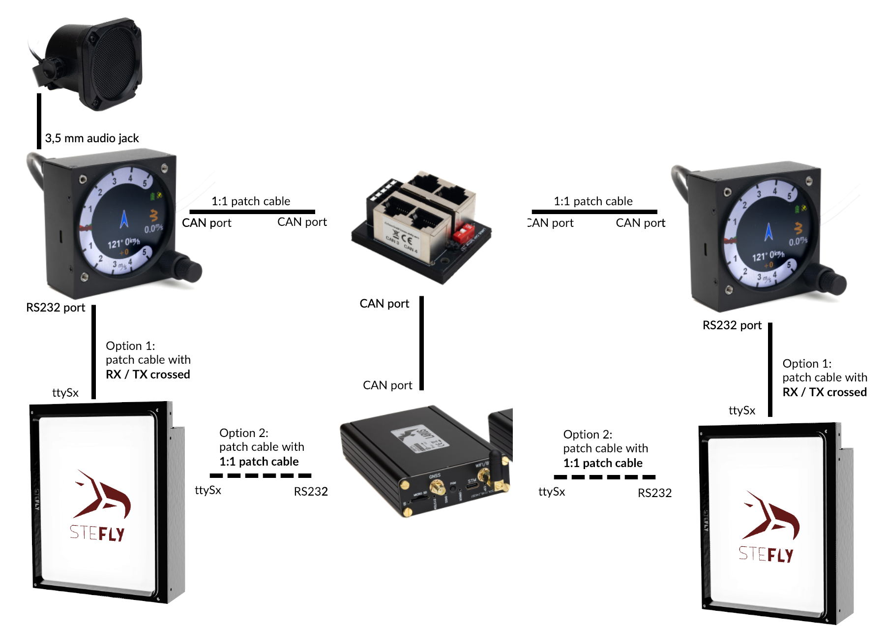
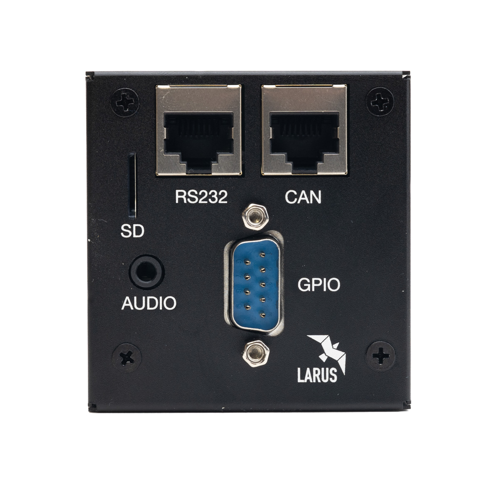
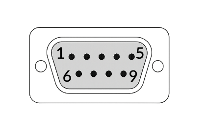
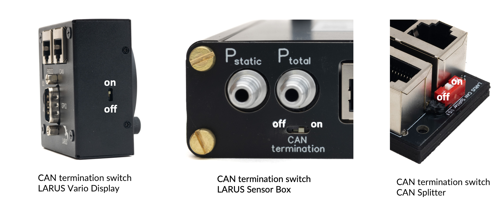

# Scope of Delivery
The scope of delivery contains the following:
* LARUS Vario Display
* Mounting screws
* 1:1 standard RJ45 cable
* Micro SD card with adapter
* D-Sub-9 solder connector and housing
* 1,5 mm HEX key for mounting the rotary knobs

# Design and Function
LARUS Vario Display shows the data measured and calculated by LARUS. LARUS is an advanced variometer with real time wind measurement capabilities. It incorporates state of the art pressure sensors, an advanced IMU and GNSS receivers to gather precise flight information data. 
Key features of the display are: 
* Round display for 57 mm standard instrument panel cutouts
* Bright and colourful screen
* Lightweight, compact design with black anodised aluminium housing
* Two rotary knobs with pushbutton fuction to change settings and enter the menus

LARUS Vario Display is designed and continuously improved by Prof. Dr. Klaus Schäfer, Maximilian Betz, Winfried Simon, Peter Simon and the SteFly team. 

The system architecture of LARUS in **single seater configuration**: 

The system architecture of LARUS in **double seater configuration**: 

# Connectors

## Overview of the Connectors

## CAN and RS232 Ports

|Pin	|CAN | RS232|
|---|------|----------------|
|1|	GND| (internally connected)	GND (internally connected)|
|2|		
|3|	NC|	RS232_1_RX|
|4|	CAN Low|	RS232_1_TX|
|5|	CAN High|	RS232_2_RX|
|6|	NC|	RS232_2_TX|
|7|	VCC [9-28V DC] (internally connected)|	VCC [9-28V DC] (internally connected)|
|8|		|

If a serial connection (RS232) is established between SteFly NAV and LARUS Vario Display, the MC value settings, for example, can be synchronized / transferred between the devices. In addition, the LARUS Vario Display processes inputs from a Speed to Fly / Vario switch that is connected directly to the SteFly Remote Control Stick PCB (for necessary settings see chapter 6). 

The following steps are required: 
* Connect devices with cable: 
 * Option 1: between Vario Display RS232 port and SteFly NAV ttySx port with patch cable RX/TX crossed
 * Option 2: between Vario Display RS232 port und LARUS Sensor Box with 1:1 patch cable
* Adjust settings in XCSoar / OpenSoar:
  * If the Vario Display is connected directly to the SteFly NAV, select the corresponding ttyS port: Config -> Devices -> select a free line and enter the port, Baud rate 38400, Driver Larus, Sync. to device on

## GPIO / D-SUB 9

Several other switches, sensors and devices can be connected via the d-sub connector. Please note that not all functions have been implemented at date of release of this manual. 

The following sketch shows the view into the male connector of the LARUS Vario Display. 

|Pin number|	Pin name |	I/O|
|----|--------|---------|
|1	|GND	|(Ground)|
|2	|DI3  |Gear - Input|
|3	|DI1 | Water Ballast - Input|
|4	|DO2|	Output, not yet supported|
|5	|GND|	(Ground)|
|6	|DI4 | Speed Brakes - Input|
|7	|DI2 | Speed to Fly	- Input|
|8	|GND |	(Ground)|
|9	|DO1 | SteFly Canopy Flasher- Output|

For easier pin identification these numbers are also molded into the female connector (scope of delivery). 
After wiring, settings must be made in the LARUS Vario Display, see chapter 6.

| test |test|
|------|-----|
| 1 | 2 |

## AUDIO
An audio socket is available for connecting a loudspeaker with a 3.5 mm jack plug.  The internal resistance of the speaker must be between 4-8 Ω (max. output of 3 W @ 8 Ω).

## SD-Card
The device has an SD card slot for firmware updates.  

| |  |
|------------------------|-------------------------------------------------------------------------------------------|
 |As SD card extensions can damage the Vario Display, we do not accept any liability for damage resulting from their use.|

# CAN Termination 

LARUS Vario Display and LARUS Sensor Box are connected via CAN. CAN bus networks require termination resistors at each end of the network. Therefore, all units have integrated a switch to activate the resistor:

 

The following table gives examples of how to set the CAN termination switches: 

|Description|Display front| Larus Box| CAN Splitter |  Display rear|
|--|--|--|--|--|
|Single seater	|on|	on|	-|	-|
|Double seater LARUS box in front panel|	off|	on|	off|	on|
|Double seater, LARUS box in rear panel|	on|	on|	off|	off|

Please note: All LARUS Sensor Boxes delivered before March 2025 have no CAN termination switch.  CAN termination is always on from default.

